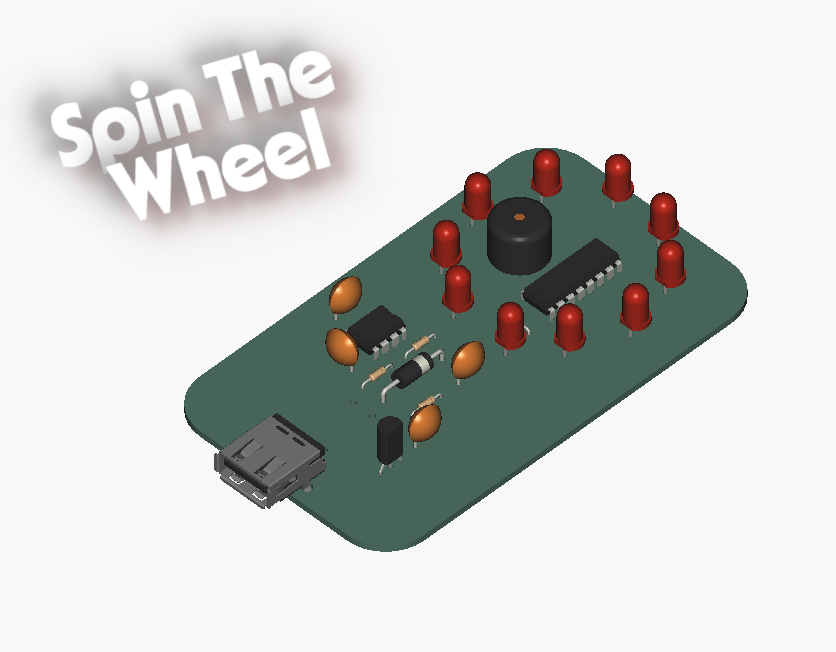
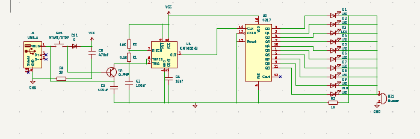
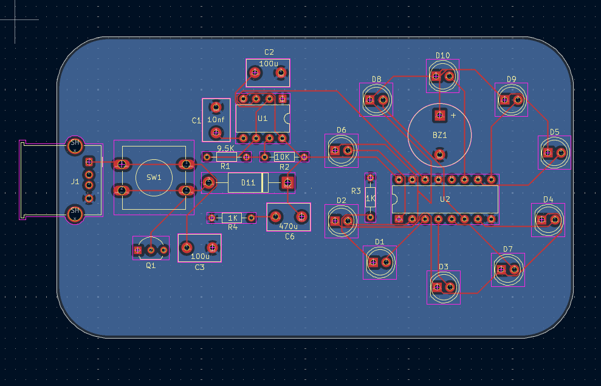

# Spin The Wheel

This project utilises a NE555 IC and a CD4017 IC to create an LED Wheel. When the user presses the start/stop button, the LEDs light up randomly. Pressing the start/stop button again reduces the speed at which the LEDs change, eventually leading to a stop.

## Schematic

## PCB

## BOM

| Designator | Value   |
| ---------- | ------- |
| BZ1        | Buzzer  |
| C1         | 10nf    |
| C2         | 100uf   |
| C3         | 100uf   |
| C6         | 470uf   |
| D1         | LED     |
| D2         | LED     |
| D3         | LED     |
| D4         | LED     |
| D5         | LED     |
| D6         | LED     |
| D7         | LED     |
| D8         | LED     |
| D9         | LED     |
| D10        | LED     |
| D11        | D       |
| J1         | USB_A   |
| Q1         | Q_PNP   |
| R1         | 9.5K    |
| R2         | 10K     |
| R3         | 1K      |
| R4         | 1K      |
| SW1        | Push    |
|            | Button  |
| U1         | NE555   |
| U2         | CD4017  |
