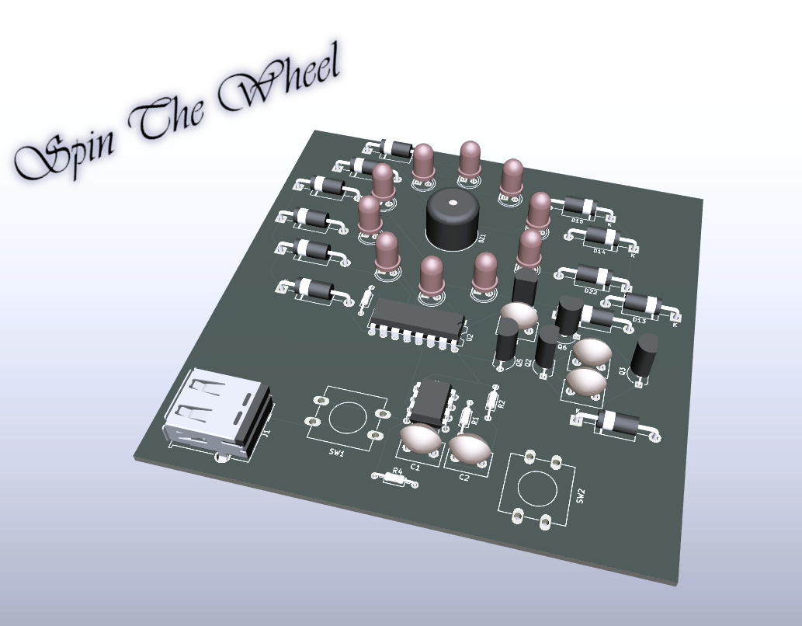
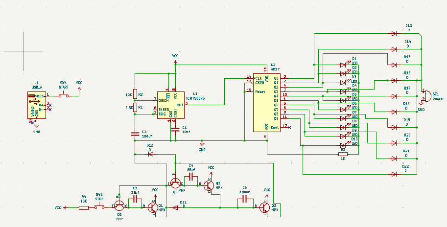
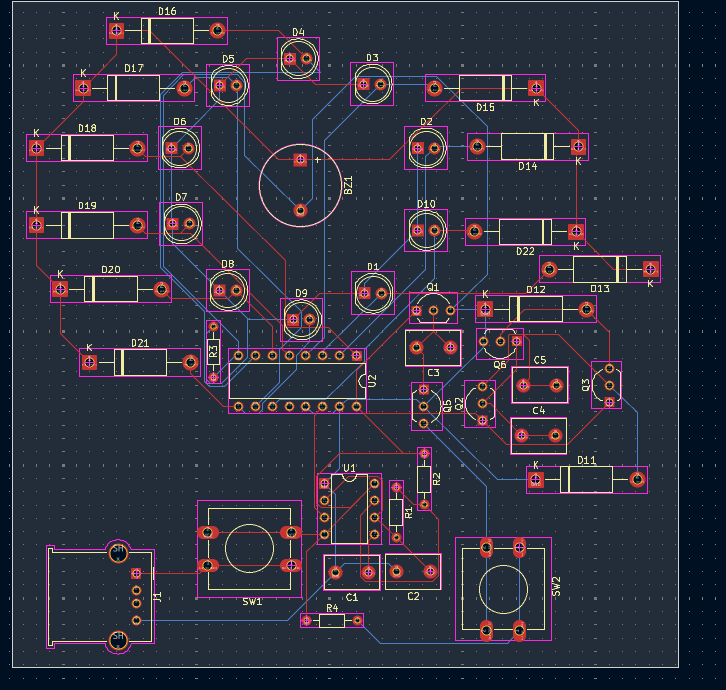

# Spin The Wheel

## Schematic

## PCB

## BOM

| Designator | Value   |
| ---------- | ------- |
| BZ1        | Buzzer  |
| C1         | 10nf    |
| "C2, C5"   | 100uf   |
| C3         | 33uf    |
| C4         | 68uf    |
| "D1, D10,  |         |
| D2, D3, D4 |         |
| , D5, D6,  |         |
| D7, D8, D9"| LED     |
| "D11, D12, |         |
| D13, D14,  |         |
| D15, D16,  |         |
| D17, D18,  |         |
| D19, D20,  |         |
| D21, D22"  | D       |
| J1         | USB_A   |
| "Q1, Q2,   |         |
| Q3"        | NPN     |
| "Q5, Q6"   | PNP     |
| R1         | 9.5K    |
| "R2, R4"   | 10K     |
| R3         | 1K,     |
| SW1        | START   |
| SW2        | STOP    |
| U1         | NE555   |
| U2         | CD4017  |

